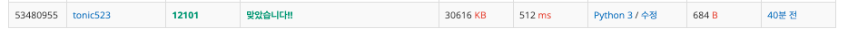

# 1, 2, 3 더하기 2

## 첫 번째 풀이
- 브루트 포스
- 순열

1. 숫자 n 을 구할 수 있는 모든 조합 케이스를 구한다.
2. 정렬 후 k 번째 조합을 출력한다.

## 두 번째 풀이
- 재귀 함수 (dfs)
- 백 트래킹

1. 총합(sum)이 n, 횟수(count)가 k 가 될 때까지 아래 함수를 반복한다.
   a. 1~4의 값을 순회한다.(i)
   b. 현재까지 sum에 i를 더한다.
   c. sum이 n 보다 작으면 // 백 트래킹
      1. 문자열 출력을 위한 스택에 i를 문자열로 더한다.
      2. a 부터 다시 실행한다.
      3. 문자열을 스택에서 제거한다.
   
2. 위 함수를 반복하다 sum이 n, count가 k가 되면 stack을 양식에 맞춰 출력한다.

