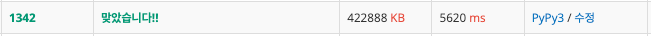

# 행운의 문자열
[링크](https://www.acmicpc.net/problem/1342)

## 풀이1

문자열의 모든 순열을 구한 후 문자열의 길이이고 이미 추가되지 않은 문자열을 count하며 풀이했다.\
모든 순열을 구하기 위해 최대 10!(3628800)을 순회하기 때문에 시간을 초과하는 것을 확인할 수 있다.\
시간은 초과됐는데 문제 풀이에는 성공했다.

## 풀이2

풀이1과 비슷하지만 여기선 Counter를 사용했다.
